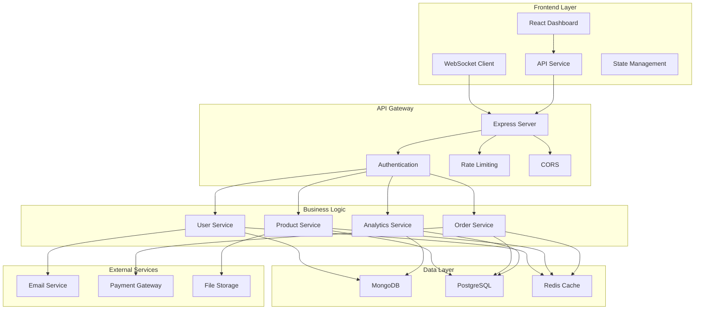

```mermaid
graph TB
    subgraph "Frontend Layer"
        A[React Dashboard]
        B[WebSocket Client]
        C[API Service]
        D[State Management]
    end
    
    subgraph "API Gateway"
        E[Express Server]
        F[Authentication]
        G[Rate Limiting]
        H[CORS]
    end
    
    subgraph "Business Logic"
        I[User Service]
        J[Product Service]
        K[Order Service]
        L[Analytics Service]
    end
    
    subgraph "Data Layer"
        M[MongoDB]
        N[PostgreSQL]
        O[Redis Cache]
    end
    
    subgraph "External Services"
        P[Email Service]
        Q[Payment Gateway]
        R[File Storage]
    end
    
    A --> C
    B --> E
    C --> E
    
    E --> F
    E --> G
    E --> H
    
    F --> I
    F --> J
    F --> K
    F --> L
    
    I --> M
    J --> N
    K --> N
    L --> M
    L --> N
    
    I --> O
    J --> O
    K --> O
    
    I --> P
    K --> Q
    J --> R
```

